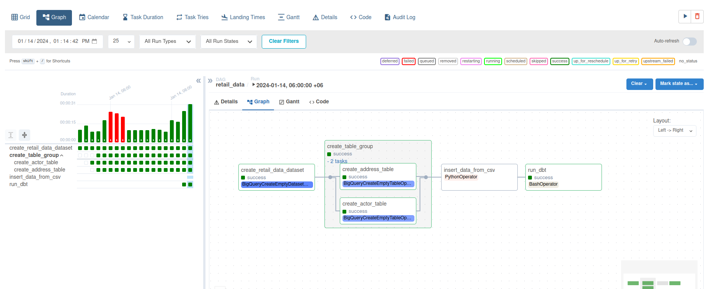

# Airflow-data-engineering-with-BigQuery-and-dbt
Fetch Data from a simple csv file, send the data in GCP BigQuery table, run dbt to automate the dwh and run soda to check data quality.



# Get Started

+ create python venv
+ enable it
+ install dependencies from ```requirements.txt``` file
+ configure airflow in airflow.cfg
+ create as GCP service account and add a key. also, download the key in json format.

# Airflow Webserver

+ In ```Variable``` section add the following three varibales
    - gcp_project
    - gcp_bigquery_retail_dataset
    - gcp_account : downloaded json file path
+ In ```Connection``` section add a new ```GCP``` connection
    - connection name: my_gcp_conn
    - value: downloaded ```service account json file content```

# Configure dbt and soda in airflow

+ at the bottom of the ```dags/data_retail_project.py```, modify the ```bash command``` with dbt and soda project dir,dbt and soda env from where the ```dbt and soda``` will run.

# Run

+ airflow webserver
+ airflow scheduler